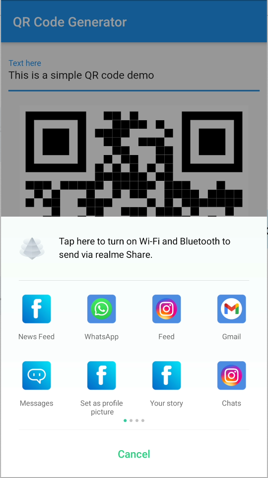

# QR Code Generator

An implementation of `qr_flutter` package to draw on screen.


QR Code Input             |  QR Code Image  |  QR Code Share
:-------------------------:|:-------------------------:|:-------------------------:
  | | 


Hey guys! Today we are going to learn about *qr_flutter** package in flutter.

`qr_flutter` is a Flutter library for simple and fast QR code rendering via a Widget.

We will be building a simple `QR Code Generator` app. In this we will be taking text input from user and convert it into QR Code. Just a small app only for demonstration. No high expectations please. Haha!

Lets begin!!!

## Step 1 :  Install Packages

Place the below dependencies in your `pubspec.yaml` file and run `flutter pub get`
```

  qr_flutter: ^4.0.0

```

This is the main package for demonstration but we will add a few more to add some functionalitites to our app.

```

  esys_flutter_share: ^1.0.2

```


## Step 2 : Declare your variables

We will be needing a few variables as shown below which are self explanatory.

```dart
GlobalKey _globalKey = new GlobalKey();
bool showQR = false;
String qrText;
```

## Step 3 : Create Input Field

We will be creating a text field whose input will be converted to a QR Code.

```dart
_buildTextInputField() {
    return TextField(
      onChanged: (text) {
        setState(() {
          showQR = false;
          qrText = text;
        });
      },
      decoration: InputDecoration(labelText: 'Text here'),
    );
  }
```

## Step 4 : Create QR Code Widget

The widget QrImage is used to convet the text into a QRCode. It is from the package we have installed in step 1. The data parms takes the text to be converted.

```dart
_buildQRCode() {
    return Padding(
      padding: const EdgeInsets.only(top: 20),
      child: Visibility(
        visible: showQR,
        child: RepaintBoundary(
          key: _globalKey,
          child: Container(
            color : Colors.white,
            child: QrImage(
              data: qrText,// your text here
              version: QrVersions.auto,
              size: MediaQuery.of(context).size.width - 50,
              gapless: false,
            ),
          ),
        ),
      ),
    );
  }
```

We have wrapped our QRImage widget into a repaing boundary so that we can convert it into a image and share it via `esys_share_flutter`.

## Step 5 : Create Buttons

We will be creating 3 buttons. They are Create, Clear, Share as show below.

```dart
_buildButtons() {
return Padding(
  padding: const EdgeInsets.only(top: 20),
  child: Row(
    mainAxisAlignment: MainAxisAlignment.center,
    children: [
      Visibility(
        visible: !showQR,
        child: ElevatedButton(
          child: Text('Create QR Code'),
          style: ElevatedButton.styleFrom(primary: Colors.blue),
          onPressed: () {
            setState(() {
              showQR = true;
            });
          },
        ),
      ),
      Visibility(
        visible: showQR,
        child: ElevatedButton(
          style: ElevatedButton.styleFrom(primary: Colors.red),
          child: Text('Clear QR Code'),
          onPressed: () {
            setState(() {
              showQR=false;
            });
          },
        ),
      ),
      Visibility(
        visible: showQR,
        child: Padding(
          padding: const EdgeInsets.only(left: 50),
          child: ElevatedButton(
            style: ElevatedButton.styleFrom(primary: Colors.green),
            child: Text('Share QR Code'),
            onPressed: () {
              _shareQRCode();
            },
          ),
        ),
      )
    ],
  ),
);
}
```

And its done. Thats all for the basic demo of a qr code generator app. You will now be able to create a QR Code from the input in text field. But as you know we will be adding some flavors to our app lets keep going with the flow.

## Step 7 : Sharing the QR Code

Now for saving the image to `ByteData` and sharing it we are using the `esys_esys_flutter_share`. First it will convert the widget into a `ByteData`. Then that ByteData is converted into `Unit8List` and later these bytes are shared into .png format. Lets dive into it.

```dart
void _qrCodeToImage() async {
try {
  RenderRepaintBoundary boundary =
      _globalKey.currentContext.findRenderObject();
  ui.Image image = await boundary.toImage(pixelRatio: 3.0);
  ByteData byteData =
      await image.toByteData(format: ui.ImageByteFormat.png);
  var pngBytes = byteData.buffer.asUint8List();
  _shareQRCodeImage(pngBytes);
  setState(() {});
} catch (e) {
  print(e);
}
}

Future<void> _shareQRCodeImage(Uint8List bytes) async {
try {
  await Share.file('Share Via', 'QRCode.png', bytes, 'image/png',
      text: 'QR Code');
} catch (e) {
  print('error: $e');
}
}
```
This will save the image in Unit8List and open the share intent for you. Now you can select the app in which you want to share this image.


That's it folks! We're done with all the coding. Just go ahead and run your app!

Fantastic!! You have just learned how to create a QRCode in flutter.

## Important:

This repository is only for providing information on `qr_flutter`. Please do not misuse it.

## Author:

* [Amit Mishra](https://github.com/amitmishra7)

If you like this tutorial please don't forget to add a **Star**. Also follow to get informed for upcoming tutorials.
